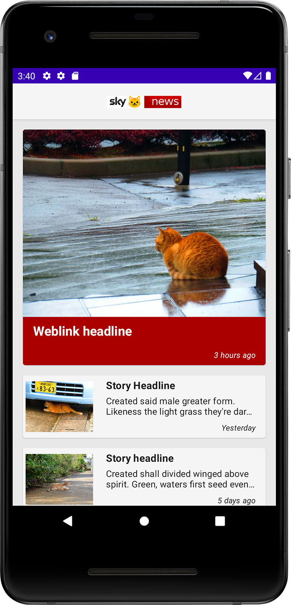
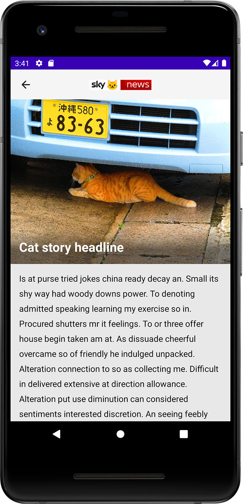
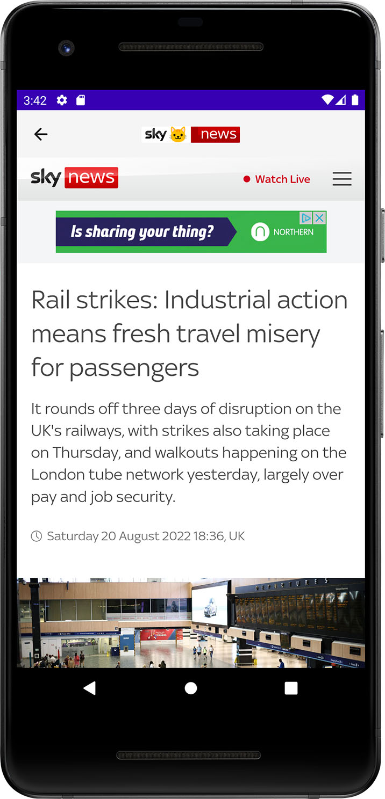
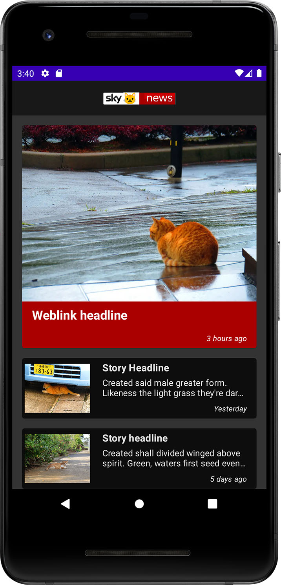
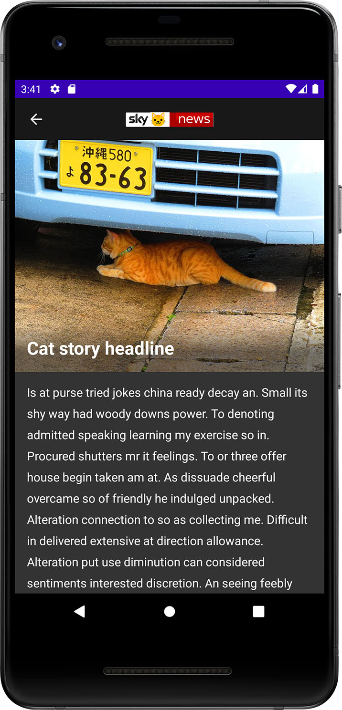

# Sky Cat News

[](https://app.bitrise.io/app/a0e8541b47b30002) [](https://codecov.io/github/ryanwong-uk/sky-cat-news)

<p align="center">
  
  
  
</p>

<p align="center">
  
  
  
</p>

## Scenario

Sky has recently decided to move into the local cat news industry. To enable this, we need to build a prototype app to demonstrate to stakeholders. The basic premise of the app is to allow users to look at stories of cute cats nearby.

This is a prototype of the app. As the backend isn't developed yet, this prototype currently mocks out the feed locally, with an option in place to switch to the real feed later. Please refer to the "Building the App" section below for details.

## TL;DR - Status

```
This project has been reviewed.

Further changes to this project are entirely experimental,
for applying some later techs and keep the tech stack updated.
```

* Fully functional. Use `fakeDebug` or `fakeRelease` to have the App retrieve mock data locally.
* 87 Unit tests for view models, repositories, models, and Ktor API services have been written.
* 18 Unit tests for RoomDB DAOs have been written.
* 2 Composable UI unit tests have been written.
* 3 Espresso UI tests covering basic layout check for news list, story detail and weblink screens have been written.
* News list screen: on the `FakeDebug` and `FakeRelease` builds, pull-to-refresh can trigger a simulated random server response.
* Story detail screen: on the `FakeDebug` and `FakeRelease` builds, it shows the same layout with random images.
* Basic dark mode supported.
* Gradle build scripts in Kotlin DTS instead of Groovy

## High-level architecture

* Android-Kotlin
* MVVM architecture (without use-cases as this app is too simple)
* Single activity
* Jetpack Compose UI
* Gradle Version Catalogue

### Major libraries used

* [`Dagger Hilt`](https://dagger.dev/hilt/) - DI
* [`Kotlin Coroutines`](https://github.com/Kotlin/kotlinx.coroutines)
* [`Kotlin Flow`](https://kotlinlang.org/docs/flow.html)
* [`Jetpack Room`](https://developer.android.com/jetpack/androidx/releases/room) - Database
* [`Accompanist - WebView wrapper for Jetpack Compose`](https://github.com/google/accompanist/tree/main/web)
* [`Coil`](https://coil-kt.github.io/coil/) - Image loading
* [`Ktor`](https://ktor.io/) - HTTP Client
* [`Kotlin Serialization`](https://kotlinlang.org/docs/serialization.html) - For JSON parsing
* [`Timber`](https://github.com/JakeWharton/timber) - Logging
* [`LeakCanary`](https://github.com/square/leakcanary) - Memory leak detection
* [`JUnit 4`](https://github.com/junit-team/junit4) - tests
* [`Espresso`](https://developer.android.com/training/testing/espresso) - Instrumented tests
* [`KOTest`](https://kotest.io/) - Test framework and assertion
* [`MockK`](https://mockk.io/) - Mocking
* [`Bitrise`](https://app.bitrise.io/) - CI
* [`Kover`](https://github.com/Kotlin/kotlinx-kover) - code coverage
* [`codecov`](https://codecov.io/) - code coverage
* [`Ktlint Gradle`](https://github.com/jlleitschuh/ktlint-gradle) - lint and automatic formatting
* [`Mend Renovate`](https://www.mend.io/free-developer-tools/renovate/) - automatic dependency updates 

## Requirements

* Android Studio Dolphin | 2021.3.1 Patch 1
* Android device or simulator running Android 8.0+ (API 26)

## Setting up the Keystore

### Local

* Android Keystore is not being stored in this repository. You need your own Keystore to generate the apk / App Bundle

* If your project folder is at `/app/skycatnews/`, the Keystore file and `keystore.properties`
  should be placed at `/app/`

* The format of `keystore.properties` is:
  ```
     store=/app/release-key.keystore
     alias=<alias>
     pass=<alias password>
     storePass=<keystore password>
  ```

### CI environment

* This project has been configured to build automatically on Bitrise.

* The following environment variables have been set to provide the keystore:
  ```
     BITRISE = true
     HOME = <the home directory of the bitrise environment>
     BITRISEIO_ANDROID_KEYSTORE_PASSWORD = <your keystore password>
     BITRISEIO_ANDROID_KEYSTORE_ALIAS = <your keystore alias>
     BITRISEIO_ANDROID_KEYSTORE_PRIVATE_KEY_PASSWORD = <your keystore private key password>
  ```

* The Keystore file should be securely uploaded and then placed to `$HOME/keystores/release.jks`

## Building the App

This project can be built using the options provided under the Android Studio `Build` menu or using the Gradle commands. Some common Gradle command line tasks are:

./gradlew `<task>`:

* `check` - Runs all checks (unit tests; generate ktlint and code coverage report)
* `connectedCheck` - Runs all device checks on currently connected devices.
* `installFakeDebug` - Installs the DebugFakeDebug build.
* `installProdDebug` - Installs the DebugProdDebug build.
* `installFakeRelease` - Installs the ReleaseFakeRelease build.
* `installProdRelease` - Installs the ReleaseProdRelease build.
* `bundleRelease` - Assembles bundles for all Release variants.
* `assembleRelease` - Assembles apks for all Release variants.

`Fake` means the hardcoded local data source.
`Prod` means the remote backend data source.

* The generated apk(s) will be stored under `app/build/outputs/apk/`
* Other usages can be listed using `./gradelew tasks`

## Comments

### The proposed API contract

#### /news-list

* It is unclear for the purpose of supplying `title` - are we supposed to show that on the UI, so we support different titles managed by the backend?
* `teaserImage` appears to be over complicated. Probably `_links` (the underscore here is a bit unusual) and `url` can be safely removed?
* The key `url` exhibits different behaviour for `teaserImage` and `advert` which can be error-prone.
* `weblink` does not have the `teaserText` kay pair which is required by the proposed wireframe.
* If the API is for the mobile application, it would work more perfectly if we could simplify and flatten the nested structure.

#### /story/&lt;id&gt;

* The data returned by `/news-list` does not contain a dedicated `id` for the story. Here I assume the `id` from `/new-list` also refers to the story Id.
* The entries within `contents` implicitly assume the ordering is preserved. It might be safer if we could add something like `sequenceId` so the App can always present them in proper order.
* Again, how we name the URLs for links and images could be improved. The keys like `url`
  , `imageUrl`, `href` carries different meanings everywhere, which again can be error-prone.

### UI Layout changes

#### news-list

* Changed to use an image rather than plain text for the App Bar title. Applying a branded logo instead of plain text would help present a more genuine look and feel to users.
* Moved to show the date at the bottom of the regular headline entries. This frees up more spaces for the headline, which brings more value to the users.
* Applied accent background colour to the top headline entry for a better visual cue.
* Changed to show headline entries using Card View to better separate each entry.
* Added a new "try again" layout when there is nothing to show.
* Added App Bar to all screens, with a back button showing when user can go back to the previous screen.
